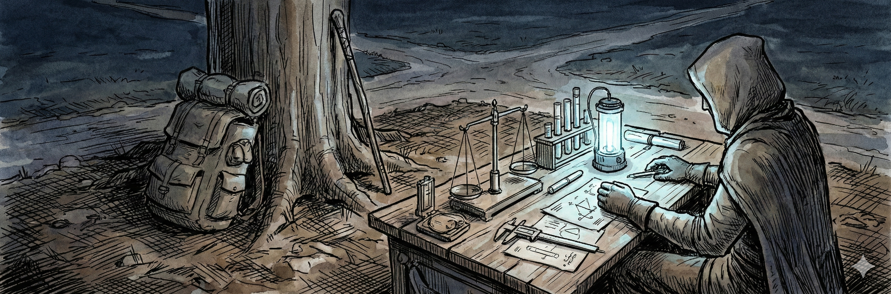

# Learn Machine Learning Through a World That Shouldn't Exist

In 847, a scholar named Pemlik Tross proposed that entities cluster not by surface similarity but by invisible threads of sympathy and antipathy—attractions and repulsions that only reveal themselves through careful measurement.

He was describing spectral clustering. He just didn't know it yet. → 

Tross is fictional. His mathematics are not.

---

## What Is This?

**Densworld** is a fictional world I've built over years—200,000+ lines of narrative, 500+ structured datasets, and a century of fictional scholarly debate. From this world, I extract the data that teaches real machine learning.

The scholars of Densworld independently "discovered" mathematical structures that mirror real ML concepts:

| Scholar | Year | Their Discovery | The Real Math |
|---------|------|-----------------|---------------|
| Erris Pol | 823 | Forms pre-exist in a Library; bodies merely read them | Latent spaces, t-SNE, UMAP |
| Pell Anster | 856 | Minds exist in hierarchies of persuadability | Hierarchical clustering |
| Pemlik Tross | 847 | Entities cluster by sympathy and antipathy | Spectral clustering, signed graphs |
| Rellen Voss | 871 | Navigation through morphospace follows resonance gradients | Gradient descent, momentum |
| Sareth Moll | 889 | Patterns persist after their substrate dies | Attention mechanisms, decay functions |
| Tessyn Mord | 902 | Collectives achieve agency through trust networks | Multi-agent systems, game theory |
| Archon Vells | 918 | Possibilities become actual through barriers | Generative models, sampling |
| Kella Vorn | 934 | We understand function through failure | Anomaly detection |

**This isn't metaphor.** When you take the *Philosophy of Pattern* series, you learn real spectral clustering by analyzing Tross's actual field measurements. The eigendecomposition is real. The graph Laplacian is real. But instead of sterile synthetic data, you're working with boundary tension measurements between entities that Tross documented in Year 847.

You can't copy the answers from Stack Overflow. This data exists nowhere else.

---

## Why Does This Work?

Most educational content faces a choice: **authentic technical depth** or **engaging context**. You rarely get both.

Densworld sidesteps this by treating worldbuilding and mathematics as the same problem: *How do you make ideas stick?*

The answer: **Embed them in a world where fictional scholars asked the questions first.**

When you learn gradient descent through Rellen Voss's navigation principles, you're not learning a metaphor for gradient descent—you're learning that Voss discovered the same mathematical structure that governs optimization, because the problems he faced (navigating morphospace) demanded exactly those tools.

The fiction doesn't water down the math. The math doesn't trivialize the fiction. They reinforce each other because they describe the same underlying structures.

---

## A Taste of the Archive

> *"The paths between forms are not straight lines through empty space, but channels carved by countless previous traversals. Where many have gone, the way becomes easier; where none have ventured, the resistance grows."*
> — Rellen Voss, *Navigation Principles* MS-2847

This is momentum in gradient descent. Voss is describing how accumulated updates create preferential pathways through parameter space. → 

> *"I have examined the same manuscript as Archivist Hennel, and where he sees a treatise on classification, I see a meditation on the impossibility of classification. We are both correct. We are examining different objects that occupy the same space."*
> — Tobin Creel, *Notes on Observer-Dependent Documentation*

This is the measurement problem. Creel is grappling with how observation constitutes its object—a question that matters for everything from quantum mechanics to data labeling.

The Capital Archives contain hundreds of such documents. They read like real scholarship because they engage real intellectual problems.

---

## The World

The Dens is not a place. It is a phenomenon—unstable ground where coordinates fail, where the distance from A to B differs from B to A, where the terrain *responds* to observation.

> *"The ground knows when you are watching. I do not expect you to believe this. I am not certain I believe it myself. But I have repeated the experiment seven times now, with identical results. The ground moves when unobserved. It holds still when observed. This is not a property of inert matter. This is behavior."*
> — Thurmond Gast, *Third Report from the Boundary*

The **Capital** sends surveyors and scholars to map it. They fail. The Council of Cartographers insists on instrumental observation; the Dens refuses to be measured. Towns at the boundary lose blocks each decade—houses, streets, families swallowed by shifting ground.

In **Yeller Quarry**, trappers harvest creatures whose behavior follows prime-number cycles. Every 2, 3, 5, 7, 11 days, the patterns shift. A mathematician named Pollus Brent discovered this grammar—then grew uncertain whether he had discovered anything at all, or merely named what the trappers already knew. → 

**Yeller herself** is five women who move in perfect synchronization. She speaks once to each person who finds her. Her words contain the answer to the question you've been asking your whole life. You cannot remember them after she finishes speaking. Some people die trying to hear her again.

In the desert of **Mirado**, a Colonel has been besieging a hovering tower for twenty years. → 

The **Archive** in the Capital knows things no individual archivist knows. Documents are found without being searched for. Knowledge persists across complete generational turnover. One scholar, Tessyn Mord, began to suspect the Archive is not a collection but a mind—and the archivists are not its managers but its neurons. → 

This is the world your data comes from. The creature catalogs, the expedition logs, the scholarly manuscripts, the survey measurements—all of it extracted from a place that shouldn't exist.

---

## What You'll Actually Do

In **Boundary Dynamics** (Course 3), you receive this assignment:

> *You have now studied Pemlik Tross's Constellation Method—the graph-based approach to classification that the Council rejected in Year 842. Your final task: Apply everything you've learned to produce a complete analysis of Densworld entity boundaries. Present your findings as Tross might have presented them to the Council—but this time, armed with computational tools that validate his intuitions.*

You will:
- Build a signed adjacency matrix from 847 sympathetic and antipathetic relationship records
- Compute the graph Laplacian (what Tross called the "tension field")
- Extract eigenvectors and perform spectral embedding
- Discover natural clusters that Tross could only intuit
- Identify boundary dwellers—entities caught between competing attractions
- Analyze negotiation records to understand how boundaries shift

The capstone asks: *Should the Council have accepted Tross's method? What would you tell him, if you could send a message back to Year 842?*

In **The Form Library** (Course 1), you implement t-SNE and UMAP to test Erris Pol's hypothesis that all Forms pre-exist in a Library. You work with a morphospace catalog of 200 Forms, each with coordinates, stability scores, and prime associations. Your task: visualize the Library and determine whether Pol's framework holds.

In **Attractor Navigation** (Course 4), you build gradient descent with momentum by analyzing 500 navigation trajectories recorded by Rellen Voss. You discover why some paths succeed and others fail—and what "navigational momentum" means mathematically.

In **Yeller Quarry Data Science** (Foundations), three children have gone missing in the quarry. You have expedition logs, creature sighting records, and behavioral data. The pandas skills you learn are real. The investigation is fictional. The answer exists in the data.

Every course works this way: real techniques, fictional stakes, data that exists nowhere else.

---

## The Courses

### Foundations
| Course | Focus |
|--------|-------|
| [Gateway to Densworld](https://github.com/buildLittleWorlds/gateway-to-densworld) | Python basics through world orientation |
| [Yeller Quarry Data Science](https://github.com/buildLittleWorlds/yeller-quarry-data-science) | Pandas through a missing-persons investigation |

### Philosophy of Pattern (8 courses)
Each course follows one scholar's framework and builds a working ML implementation.

| Course | Scholar | You Will Learn |
|--------|---------|----------------|
| [The Form Library](https://github.com/buildLittleWorlds/philosophy-form-library) | Erris Pol | Dimensionality reduction, t-SNE, UMAP |
| [Hierarchy of Minds](https://github.com/buildLittleWorlds/philosophy-hierarchy-of-minds) | Pell Anster | Hierarchical clustering, dendrograms |
| [Boundary Dynamics](https://github.com/buildLittleWorlds/philosophy-boundary-dynamics) | Pemlik Tross | Spectral clustering, signed graphs, graph Laplacians |
| [Attractor Navigation](https://github.com/buildLittleWorlds/philosophy-attractor-navigation) | Rellen Voss | Gradient descent, momentum, optimization |
| [Ghost Persistence](https://github.com/buildLittleWorlds/philosophy-ghost-persistence) | Sareth Moll | Memory systems, attention, exponential decay |
| [Modular Agency](https://github.com/buildLittleWorlds/philosophy-modular-agency) | Tessyn Mord | Multi-agent systems, trust networks |
| [Ingression Mechanics](https://github.com/buildLittleWorlds/philosophy-ingression-mechanics) | Archon Vells | Generative models, latent space sampling |
| [Pathology and Failure](https://github.com/buildLittleWorlds/philosophy-pathology-failure) | Kella Vorn | Anomaly detection, failure analysis |

### Hugging Face Series (7 courses)
From first inference call to deploying domain-specific models—all using Densworld content.

| Course | Focus |
|--------|-------|
| [The Archivist's Inference Engine](https://github.com/buildLittleWorlds/archivist-inference-engine) | Pipelines, basic inference |
| [Expedition Cartographer Workshop](https://github.com/buildLittleWorlds/expedition-cartographer-workshop) | Embeddings, retrieval systems |
| [Space Builders Mirado](https://github.com/buildLittleWorlds/space-builders-mirado) | Model fine-tuning |
| [Forge Yeller Quarry](https://github.com/buildLittleWorlds/forge-yeller-quarry) | Generative models |
| [Densworld Oracle](https://github.com/buildLittleWorlds/densworld-oracle) | Conversational AI |
| [Wanderer Experiments](https://github.com/buildLittleWorlds/wanderer-experiments) | Advanced applications |
| [Noise and the Signal](https://github.com/buildLittleWorlds/noise-and-signal) | Synthesis and reflection |

### Spatial Series (5 courses)
Where coordinates curve, measurement becomes philosophy, and the Archive's classification systems start to fail.

| Course | Focus |
|--------|-------|
| [The Surveyor's Art](https://github.com/buildLittleWorlds/surveyors-art) | Time series, hypothesis testing |
| [The Cartographer's Dilemma](https://github.com/buildLittleWorlds/cartographers-dilemma) | Coordinate systems, observer effects |
| [The Archivist's Paradox](https://github.com/buildLittleWorlds/archivists-paradox) | Classification, information theory |
| [The Senator's Question](https://github.com/buildLittleWorlds/senators-question) | Policy analysis, text mining |
| [The Translation](https://github.com/buildLittleWorlds/the-translation) | The fourth wall breaks |

### Access Architectures (5 courses)
Build production systems that grant controlled access to fictional worlds.

| Course | Focus |
|--------|-------|
| [The Oracle's Gate](https://github.com/buildLittleWorlds/access-oracles-gate) | Conversational access with guardrails |
| [The Cartographer's API](https://github.com/buildLittleWorlds/access-cartographers-api) | Programmatic data access |
| [The Generator's Forge](https://github.com/buildLittleWorlds/access-generators-forge) | Constrained generative access |
| [The Architect's Dilemma](https://github.com/buildLittleWorlds/access-architects-dilemma) | Access philosophy and policy |
| [The Living World](https://github.com/buildLittleWorlds/access-living-world) | Capstone: integrated platform |

### Standalone Courses
| Course | Focus |
|--------|-------|
| [Capital Archives NLP](https://github.com/buildLittleWorlds/capital-archives-nlp) | Natural language processing |
| [ML Math with Densworld](https://github.com/buildLittleWorlds/ml-math-with-densworld) | Statistics, linear algebra, calculus |
| [Journeys and Graphs](https://github.com/buildLittleWorlds/journeys-and-graphs) | Graph theory and networks |
| [Codes & Puzzles](https://github.com/buildLittleWorlds/codes-puzzles-pattern-recognition) | Pattern recognition |
| [Constructed Languages](https://github.com/buildLittleWorlds/constructed-languages-formal-systems) | Formal language theory |

---

## The Masters Program

**Master of Arts in Speculative Mathematics** — a self-paced graduate curriculum exploring whether retrieval-based and geometry-based mathematical frameworks can be reconciled.

This isn't a metaphor either. There's a real schism in how mathematicians approach intelligence: some see cognition as *lookup* (retrieval, discrete, database-like), others as *movement* (geometric, continuous, manifold-like). The scholars of Densworld embody both traditions without knowing the other exists.

| Semester | Focus |
|----------|-------|
| 1 | [Mathematical Foundations](https://github.com/buildLittleWorlds/masters-program-semester-1) |
| 2 | [The Retrieval Tradition](https://github.com/buildLittleWorlds/masters-program-semester-2) |
| 3 | [The Geometric Tradition](https://github.com/buildLittleWorlds/masters-program-semester-3) |
| 4 | [Synthesis & Thesis](https://github.com/buildLittleWorlds/masters-program-semester-4) |

**Prerequisite:** [The Cartographer's Eye](https://github.com/buildLittleWorlds/masters-cartographers-eye) — Visual mathematics using AI image generation.

**Resources:** [Program Overview](https://github.com/buildLittleWorlds/masters-program-overview) | [Math Primers](https://github.com/buildLittleWorlds/masters-program-primers)

---

## Where to Start

**Complete beginner?**
[Gateway to Densworld](https://github.com/buildLittleWorlds/gateway-to-densworld) teaches Python basics while orienting you to the world.

**Know Python, want ML fundamentals?**
Start with [The Form Library](https://github.com/buildLittleWorlds/philosophy-form-library) — the first course in the Philosophy of Pattern series.

**Want to build with modern AI infrastructure?**
[The Archivist's Inference Engine](https://github.com/buildLittleWorlds/archivist-inference-engine) begins the Hugging Face series.

**Curious about the mathematics of intelligence?**
[The Cartographer's Eye](https://github.com/buildLittleWorlds/masters-cartographers-eye) prepares you for the Masters Program.

---

## About

I'm Daniel Plate—AI researcher, applied AI professor, and creative writer at [Lindenwood University](https://www.lindenwood.edu/arts-and-humanities/english-language-interdisciplinary-studies/).

**Credentials:** Ph.D. Literature (Washington University in St. Louis), M.A. Human-Centered AI (Lindenwood), M.F.A. Creative Writing (University of Arkansas)

**Recent publications:**
- *Beyond Code: Redefining Programming Education Beyond STEM* (CRC Press/Routledge, 2025)
- *The Case Against Disclosure: Defending Creative Autonomy in the Age of AI* (Common Ground, 2025)
- *Generative AI in the English Composition Classroom* (Routledge, 2024)

**Contact:** DPlate@lindenwood.edu

---

*These courses are independent personal projects, not institutional materials. The Densworld archive and all derived datasets are original creative and intellectual property.*
